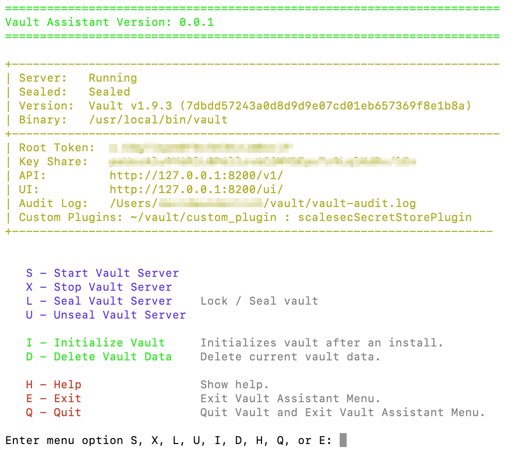

# vault-assistant
Vault assistant is a quick and easy way to install, configure and run Hashicorp Vault.  It provides a dock application to start; stop; seal; unseal and other support functions.

**vault-install.sh:** Run this shell script to download and install the current version of Vault.  It will setup and configure vault and install the ScaleSec Vault Assistant  

**vault-assistant-install.sh:** Run this shell script if you want to reinstall the ScaleSec Vault Assistant.

## Customizing Installation

*vault-install.sh {vault version number} :* vault-install.sh takes a vault version number and will attempt to download; install and configure that version.  

*VAULT_ROOT:* If you want vault installed and managed in a directory other than ~/vault change this value in vault-install.sh; vault-assistant-install.sh and vault-assistant.sh before proceeding with the install.

## Customizing ScaleSec Vault Assistant:
The ScaleSec Vault Assistant is an apple script app that call the vault-assistant.sh script.  You can customize the vault-assistant.sh script by directly modifying the shell script.  You can customize the apple script app by following these steps:

1. unzip the file: vault-assistant.app.zip
2. Open the vault-assistant.app file with the Automator app
3. When done save the application
4. copy the vault-assistant-icon.icns to the vault-assistant.app/Contents/Resources directory as ApplicationStub.icns  .. Yes .app is a directory that is seen as a file by the Automator app
5. compress the modified vault-assistant.app directory and replace it with the current version of vault-assistant.app.zip
6. Run vault-assistant-install.sh to install your new version
